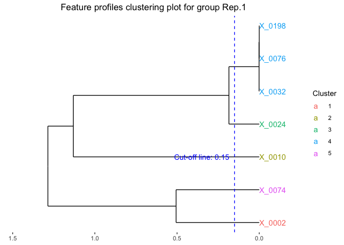

<!-- README.md is generated from README.Rmd. Please edit that file -->

# MicrobTiSDA 

<!-- badges: start -->

[](https://opensource.org/licenses/MIT)
[](https://doi.org/10.5281/zenodo.16987942)
<!-- badges: end -->

MicrobTiSDA focuses on analyzing microbiome time-series data. Its core
functionalities include inferring species interaction relationships
within time-series data, constructing abundance time regression models
for microbial features, and assessing the similarity of temporal
abundance patterns among different microbial features. It integrates the
“Learning Interactions from Microbial Time Series” algorithm based on
the discrete-time Lotka-Volterra model, and supports the construction of
natural spline regression models to characterize changes in microbial
feature abundance over time.

## Workflow
# 

## Installation

You can install the development version of MicrobTiSDA from
[GitHub](https://github.com/) with:

``` r
# install.packages("devtools")
# library("devtools)
# install_github("Lishijiagg/MicrobTiSDA")
```

## For beginners

Here is an example of applying MicrobTiSDA to an in vitro cultured
aquatic microbiome dataset. The dataset was obtained from the study by
[Fujita et al](https://microbiomejournal.biomedcentral.com/articles/10.1186/s40168-023-01474-5).

First, we should load MicrobTiSDA and other necessary packages.

``` r
library(tidyr)
library(dplyr)
library(ggplot2)
library(MicrobTiSDA)
```

In this dataset, the in vitro cultivation of aquatic microbiomes was
conducted in eight replicate experiments. Each replicate involved
continuous cultivation for 110 days, with daily sampling performed
throughout the entire period. As a result, a total of 880 aquatic
microbiome community samples were obtained. In total, 28 ASVs were
detected across all samples.

``` r
data("fujita.data")
data("fujita.meta")
data("fujita.taxa")
```

Please note that MicrobTiSDA has specific format requirements for the microbial community count tables, metadata, and taxonomic annotation files provided by users. If you need to run your own data, please prepare them strictly according to the following examples:

- The count table (OTU/ASV table) must have OTU/ASV IDs as row names and
  sample IDs as column names, and no annotations attached.

``` r
head(fujita.data[,c(1:6)])
#>        S_00073 S_00169 S_00265 S_00361 S_00457 S_00553
#> X_0002   11932   10453    8974    4452    6881    6651
#> X_0004       0       0       0       0       0       0
#> X_0007       0       0       0       0       0       0
#> X_0008       0       0       0       0       0       0
#> X_0010       0       0       0       0       0       0
#> X_0015       0       0       0       0       0       0
```

- The metadata file must use sample IDs as row names, with additional
  sample information as column names. The columns must include the
  sampling time (Time) and either group (Group) or individual (SampleID)
  information for each sample. MicrobTiSDA uses these details to perform
  species inference, construct microbial abundance time regression
  models, interpolate missing data, construct random forest
  classification models, and other analyses.

``` r
head(fujita.meta[,c(1:6)])
#>         time resource inoculum replicate.id         treat1 treat2
#> S_00073    1 Medium-C    Water        Rep.1 Water/Medium-C     WC
#> S_00169    2 Medium-C    Water        Rep.1 Water/Medium-C     WC
#> S_00265    3 Medium-C    Water        Rep.1 Water/Medium-C     WC
#> S_00361    4 Medium-C    Water        Rep.1 Water/Medium-C     WC
#> S_00457    5 Medium-C    Water        Rep.1 Water/Medium-C     WC
#> S_00553    6 Medium-C    Water        Rep.1 Water/Medium-C     WC
```

- The taxonomic annotation table should have microbial features (OTU/ASV
  IDs) as row names, and the columns should represent taxonomic
  annotations for each feature. These annotations must be split into
  different taxonomic levels (e.g., arranged sequentially from kingdom
  to species)

``` r
head(fujita.taxa)
#>            ID  Kingdom         Phylum               Class
#> X_0001 X_0001 Bacteria Proteobacteria Gammaproteobacteria
#> X_0002 X_0002 Bacteria Proteobacteria Gammaproteobacteria
#> X_0003 X_0003 Bacteria   Bacteroidota         Bacteroidia
#> X_0004 X_0004 Bacteria     Firmicutes          Clostridia
#> X_0005 X_0005 Bacteria Proteobacteria Gammaproteobacteria
#> X_0006 X_0006 Bacteria Proteobacteria Gammaproteobacteria
#>                                      Order                Family
#> X_0001                    Enterobacterales          Yersiniaceae
#> X_0002                       Aeromonadales        Aeromonadaceae
#> X_0003                     Chitinophagales      Chitinophagaceae
#> X_0004 Peptostreptococcales-Tissierellales Peptostreptococcaceae
#> X_0005                     Xanthomonadales      Xanthomonadaceae
#> X_0006                     Pseudomonadales      Pseudomonadaceae
#>                   Genus      Species       identified
#> X_0001         Yersinia unidentified         Yersinia
#> X_0002        Aeromonas unidentified        Aeromonas
#> X_0003     unidentified unidentified Chitinophagaceae
#> X_0004   Clostridioides   mangenotii       mangenotii
#> X_0005 Stenotrophomonas unidentified Stenotrophomonas
#> X_0006      Pseudomonas unidentified      Pseudomonas
```

Next, we need to perform filtering on the feature table in this dataset.
However, given the relatively small number of microbial features (ASVs)
in this dataset, we chose not to filter out ASVs with low abundance or
low prevalence.

``` r
fujita_filt = Data.filter(Data = fujita.data,
                          metadata = fujita.meta,
                          OTU_counts_filter_value = 0,
                          OTU_filter_value = 0,
                          Group_var = 'replicate.id')

# The output object of function Data.filter is an S3 class object, use summary() to check the output result.
#summary(fujita_filt)
```

Typically, the filtered data need to be transformed prior to analysis.
MicrobTiSDA provides a modified centered log-ratio (MCLR) transformation
for this purpose. This transformation is performed separately for each
sampled individual or experimental group; therefore, users are required
to specify the grouping variable from the metadata. In this dataset, the
variable representing the eight replicate experiments is “replicate.id”.

``` r
fujita_trans = Data.trans(Data = fujita_filt,
                          metadata = fujita.meta,
                          Group_var = 'replicate.id')
```

After filtering and transforming the dataset, MicrobTiSDA can be used to
infer species interactions within each individual subject or replicate
microbiome. By integrating the “Learning Interactions from Microbial
Time-Series” (LIMITS) framework, MicrobTiSDA is able to infer sparse
interaction networks from microbiome time-series data. This step may
take a considerable amount of time to complete, depending on the size of
the dataset.

``` r
fujita_interact = Spec.interact(Data = fujita_trans,
                                metadata = fujita.meta,
                                Group_var = 'replicate.id',
                                num_iterations = 10)
```

Next, we can visualize the results of the species interaction inference.
The function generates network plots of species interactions for each
replicate aquatic microbiome experiment.

``` r
fujita_interact_vis = Interact.dyvis(Interact_data = fujita_interact,
                                     threshold = 1e-6,
                                     core_arrow_num = 4,
                                     Taxa = fujita.taxa)
```

We can use the function to visualize species interaction networks. The
parameter allows users to specify which group or individual to display.
For instance, to visualize the species interaction network only for the
first replicate experiment (Rep.1) in the dataset, specify . If no group
is specified, the network for each group will be plotted by default.

``` r
plot(fujita_interact_vis,groups = "Rep.1")
#> Plot: Rep.1
```
# 
Please note that the output is an interactive HTML chart supporting
zooming and dragging for detailed exploration. However, since
interactive htmlwidgets cannot be rendered here, only a static
screenshot is displayed. In the chart, arrow colors indicate interaction
types: orange represents positive interactions, and blue represents
negative interactions. Nodes represent species, with keystone species
(i.e., those involved in multiple pairwise interactions) highlighted in
yellow.

After completing species interaction inference for the aquatic
microbiome, we can proceed to analyze the temporal abundance patterns of
microbial features using MicrobTiSDA. To support this analysis,
MicrobTiSDA provides a method for fitting regression models to the
abundance trajectories of microbial features. To begin, we first need to
construct a design matrix for modeling temporal trends for each
microbial feature. This can be accomplished using the function, where
users must specify the variables in the metadata that represent the
group ID for each subject or replicate, the sample ID, and the time
point of each sample.

``` r
fujita_design = Design(metadata = fujita.meta,
                       Group_var = 'replicate.id',
                       Sample_ID = 'timeChar',
                       Pre_processed_Data = fujita_trans,
                       Sample_Time = 'time')
```

When fitting regression models for each microbial feature, MicrobTiSDA
employs natural spline regression. Users can manually specify the
positions of spline knots by providing a vector—for example, sets the
10th, 20th, and 30th days in the time series as knot positions.
Alternatively, MicrobTiSDA can automatically determine the optimal
number and placement of knots using generalized cross-validation, based
on a user-defined maximum number of knots .

``` r
fujita_model = Reg.SPLR(Data_for_Reg = fujita_design,
                      pre_processed_data = fujita_trans,
                      max_Knots = 5,
                      unique_values = 5)
```

here, it is important to account for the sparsity and zero-inflated
nature of microbiome data. The function includes the parameter, which
specifies the minimum number of non-zero abundance values required
across time-series samples for a microbial feature to be included in
regression modeling. By default, this threshold is set to at least 5
non-zero values.

Based on the fitted regression models, we can predict the temporal
abundance patterns of each microbial feature. These features can then be
clustered according to the similarity of their abundance temporal
patterns, using correlation distance as the clustering metric.

``` r
fujita_model_pred = Pred.data(Fitted_models = fujita_model,
                              metadata = fujita.meta,
                              Group = 'replicate.id',
                              Sample_Time = 'time',
                              time_step = 1)

fujita_model_clust = Data.cluster(predicted_data = fujita_model_pred,
                                  clust_method = 'average',
                                  dend_title_size = 12,
                                  font_size = 3)

# Visualize the feature clustering of the first replicate.
plot(fujita_model_clust,groups = "Rep.1")
```


We can also identify the optimal clusters of microbial features based on
the clustering results. Here we select features with correlation
distance less than 0.15 for clustering.

``` r
fujita_clust_results = Data.cluster.cut(cluster_outputs = fujita_model_clust,
                                        cut_height = 0.15,
                                        font_size = 4)

# Visualize the feature clustering of the first replicate.
plot(fujita_clust_results,groups = "Rep.1")
```


Finally, we can visualize the abundance patterns of microbial features
within each selected cluster.

``` r
fujita_model_vis = Data.visual(cluster_results = fujita_clust_results,
                               cutree_by = 'height',
                               cluster_height = rep(0.15,8),
                               predicted_data = fujita_model_pred,
                               Design_data = fujita_design,
                               pre_processed_data = fujita_trans,
                               plot_dots = TRUE,
                               figure_x_scale = 20,
                               Taxa = fujita.taxa,
                               plot_lm = FALSE,
                               legend_title_size = 10,
                               legend_text_size = 10,axis_x_size = 10,axis_title_size = 10,axis_y_size = 10)

# Use plot() to visualize temporal profiles of clustered microbial features.
# For example, we can visualize the fourth feature cluster temporal profiles of the first replicate.
plot(fujita_model_vis, groups = "Rep.1", clusters = 4)
#> In Rep.1, number of feature clusters -- 5
#> `geom_smooth()` using method = 'loess' and formula = 'y ~ x'
```


